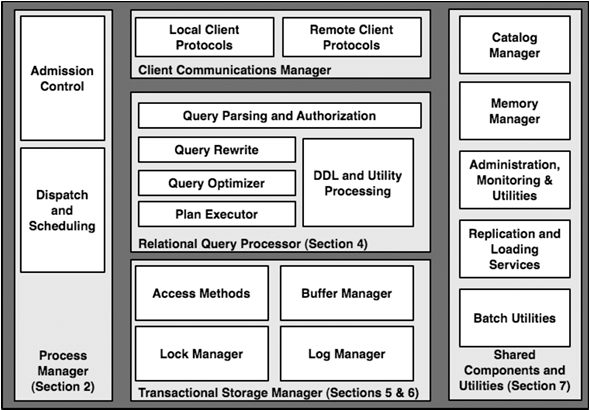

# Storage Manager I/O Strategy

## Context

As I explained in the previous article, initially, I considered the simplest route—opening and closing the database file on every command. This is a perfectly fine approach for a learning project but I wanted to learn more about the challenges of real-world systems where this kind of approach would introduce severe performance and scalability issues: repeated system calls, lack of shared buffering, and poor concurrency handling. 

To identify a more robust design suitable for production-grade systems, while looking for how this issue can be solved I came across the seminal paper called [**“The Architecture of a Database System”**](https://db.cs.berkeley.edu/papers/fntdb07-architecture.pdf) by Joseph M. Hellerstein, Michael Stonebraker, and James Hamilton. 

A thing to note is that this paper is from 2007 and it might be outdated but I do not have enough knowledge on the topic to judge this. Regardless, it's interesting to read about the vision of how things would develop in the future from this perspective. 

For example:

> "A somewhat related architectural shift is being foreseen on a more 'macro' scale, in the realm of services-oriented computing. Here, the idea is that large datacenters with tens of thousands of computers will host processing (hardware and software) for users. At this scale, application and server administration is only affordable if highly automated."

## Process Models

This article presented a great overview of the main components presented in the figure:

The step I am currently on falls under **Process Manager** (left side of the diagram).

The initial solution was to run the program pretty much as a script with input arguments. However, real-world systems are multi-user servers and related to that, the authors stated the following:

> "When designing any multi-user server, early decisions need to be made regarding the execution of concurrent user requests and how these are mapped to operating system processes or threads. These decisions have a profound influence on the software architecture of the system, and on its performance, scalability, and portability across operating systems."

The article also emphasizes the following definitions:

- An **Operating System Process** combines an operating system (OS) program execution unit (a thread of control) with an address space private to the process. Included in the state maintained for a process are OS resource handles and the security context. This single unit of program execution is scheduled by the OS kernel and each process has its own unique address space.

- An **Operating System Thread** is an OS program execution unit without additional private OS context and without a private address space. Each OS thread has full access to the memory of other threads executing within the same multithreaded OS Process. Thread execution is scheduled by the operating system kernel scheduler and these threads are often called “kernel threads” or k-threads.

- A **Lightweight Thread Package** is an application-level construct that supports multiple threads within a single OS process. Unlike OS threads scheduled by the OS, lightweight threads are scheduled by an application-level thread scheduler. Lightweight threads have faster thread switches since there is no kernel mode switch needed, but any blocking operation blocks all threads in the process. To avoid this, only asynchronous (non-blocking) I/O requests are issued, and no OS-blocking operations are invoked. Generally, programming with lightweight threads is more difficult than with OS processes or OS threads.

- Some DBMSs implement their own **lightweight thread (LWT) packages**. These are special cases of general LWT packages, and we simply refer to these threads as **DBMS threads** when the distinction is unnecessary.

- A **DBMS Client** is the software component that implements the API used by application programs to communicate with a DBMS (e.g., JDBC, ODBC, OLE/DB). The DBMS client component marshals calls to these APIs and sends them over some (often proprietary) communication protocol to the DBMS.

- A **DBMS Worker** is the thread of execution in the DBMS that does work on behalf of a DBMS Client. A 1:1 mapping exists between a DBMS Worker and a DBMS Client. The worker handles all SQL requests from a single client.

These definitions are important for understanding the three process models for handling concurrency presented in the article:

> "In this simplified context, a DBMS has three natural process model options. From the simplest to the most complex, these are: (1) process per DBMS worker, (2) thread per DBMS worker, and (3) process pool. Although these models are simplified, all three are in use by commercial DBMS systems today."

A brief summary of these:

1. **Process per DBMS Worker**: Easy isolation but heavy resource usage; requires shared memory for buffer pools  
2. **Thread per DBMS Worker**: Lightweight context switching but complex synchronization  
3. **Process Pool**: Fixed or dynamic pool of processes; balances overhead and isolation

## Chosen Approach: Process Pool

I decided to implement a **Process Pool**. This approach balances:

- **Performance**: Avoids repeated open/close overhead  
- **Isolation**: Each process has its own file descriptor and independent buffer state  
- **Resource Efficiency**: Limits the number of OS processes via a pool

## Pros and Cons of the Process Pool Approach

**Pros:**

- **Lower Latency**: Reusing open file descriptors reduces system call overhead  
- **Process Isolation**: Faults in one worker don’t affect others  
- **Controlled Concurrency**: Pool size limits resource usage under load

**Cons:**

- **IPC Complexity**: Requires robust inter-process communication for dispatching commands and retrieving results  
- **Error Handling**: Must detect and recover from crashed worker processes  
- **Cache Coherence**: Independent buffer state per process can lead to stale reads unless synchronized

## Shared Data and Process Boundaries

This solves only a part of the problem. Each one of the approaches offers a unique solution to the issue of executing client requests concurrently; however, they will still inevitably have to read/modify the same database.

Quoting the article again:

> "In all three models, data must be moved from the DBMS to the clients. This implies that all SQL requests need to be moved into the server processes and that all results for return to the client need to be moved back out. How is this done? The short answer is that various buffers are used. The two major types are disk I/O buffers and client communication buffers."

## Next Steps

- Implement the process pool
- Build a lock manager and logging subsystem for transactional safety  
- Explore adding a shared-memory buffer pool for cross-process caching
