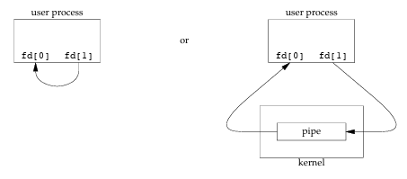
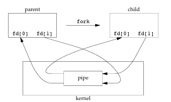
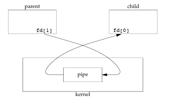
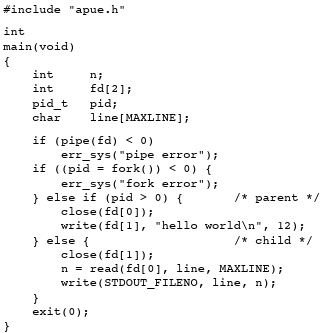

# Journal Entry - June 3rd, 2025

I have done a lot of reading but haven't taken the time in a while to write down the findings, and I will need to make sure to keep up with making journal entries as I do the readings, as I forget a lot and lose the sources.

At this point I feel bad that I am not doing more practical work, but as soon as I start implementing something I realize it's not right in some way. Anyway, let's continue where we left off at the previous entry.

## Inter-Process Communication

In the previous entry I was talking about creating new processes and needing a way to communicate between processes. For this I used the already mentioned OSTEP book for the intro and the book [Advanced Programming in the UNIX Environment, 3rd Edition](https://www.amazon.com/Advanced-Programming-UNIX-Environment-3rd/dp/0321637739) by W. Stevens and Stephen Rago, for a more in-depth understanding.

### Pipes in UNIX Systems

The OSTEP book introduces the concept of pipes in UNIX systems by using the example of a simple word count program. We can look for a word in a file using the `grep` command and then use that as the input of a new process, that would run the word counter program that would then count the number of occurrences of the word.

For the more in-depth understanding, I used Chapter 15 of the Stevens and Rago book that talks about inter-process communication. As stated in this book, pipes in UNIX systems have two limitations:

1. Historically, they have been half duplex
2. Can be used only between processes that have a common ancestor

However, FIFOs get around the second limitation and UNIX domain sockets get around both limitations.

### Pipe Creation

In order to create a pipe, we need to pass an `int` array of size 2 to the `pipe` function.

If the creation is successful, the function returns 0 and -1 if it's not.

What the function does is that it returns 2 file descriptors through the array that was passed in. The element at index 0 is the file descriptor that is open for reading and the element at index 1 is the file descriptor that is open for writing. The output of `fd[1]` is the input for `fd[0]`.
Two ways to view a half-duplex pipe:


> *[Image reference: Stevens & Rago book, Chapter 15, page 535]*

However, this is pretty much useless and a usual workflow is to create a pipe and then call `fork`, as shown in the image:


> *[Image reference: Stevens & Rago book, Chapter 15, page 536]*

### Data Flow Direction

What happens next depends on the data flow direction. If we assume the flow from parent to child, the parent closes the read end of the pipe (`fd[0]`) and the child closes the write end (`fd[1]`). The resulting arrangement of descriptors:


> *[Image reference: Stevens & Rago book, Chapter 15, page 536]*

### Pipe Closing Rules

When one end of a pipe is closed, two rules apply:

1. If we read from a pipe whose write end has been closed, `read` returns 0 to indicate an end of file after all the data has been read.
2. If we write to a pipe whose read end has been closed, the signal `SIGPIPE` is generated. If we either ignore the signal or catch it and return from the signal handler, `write` returns −1 with `errno` set to `EPIPE`.

 Example Code:


> *[Code example reference: Stevens & Rago book, Chapter 15, page 537]*

### Using Standard Input/Output with Pipes

Now what we can do is use standard input and standard output by duplicating the pipe descriptors onto standard input/output. One thing we have to be careful about in this case is that the descriptor doesn't already have the desired value. Because if the parameters of the `dup2` function are different, then we have something like this:

```
dup2(old_fd, new_fd) -> closes new_fd if it's open and makes it point to the same file as old_fd.
```

However, if both parameters to the `dup2` function are the same, it does nothing and just returns the `new_fd`. If we then call the `close` function we are closing the single instance of the descriptor. This is not very likely to happen, but imagine the case if `old_fd` was equal to zero and we do something like `dup2(old_fd, STDIN_FILENO)` and then if we do `close(old_fd)`, we just closed stdin. That's why we have to take the defensive programming approach and check before we do the `dup2`, `close` steps:

```c
if (fd[0] != STDIN_FILENO) { 
    if (dup2(fd[0], STDIN_FILENO) != STDIN_FILENO) 
        err_sys("dup2 error to stdin"); 
    close(fd[0]); /* don't need this after dup2 */ 
}
```

## Reflection

I have copied a lot of this entry word for word from the book, but the thing is, this whole book was so well written that I understood it on the first go and there was no need to rephrase it using my own words. With that being said, the book introduces a lot more concepts, examples and functionalities and it is an amazing resource.